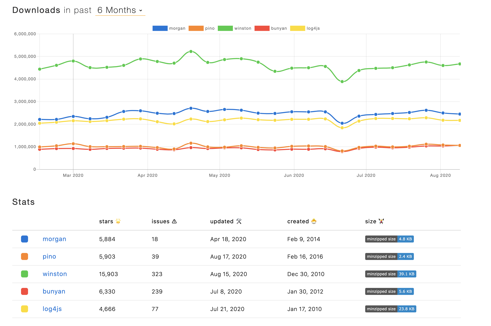

<p align="center">
    
</p>

## Benchmark Metric :matrix:
- Drop Rate: 로그가 전달하는 과정 가운데 손실되는 비율
- Individual Request Handling Time: 하나의 리쿼스트를 처리하는데 소용되는 시간
- Average Total Request Handling Time: 예를 들어 100,000 만개의 처리를 하는데 드는 시간

---

## Getting Started
여기서부터는 각 로깅 모듈을 사용해 보고 해당 장단점을 나열하겠다.


### winston :
“A multi-transport async logging library for Node.js.”

설명에서 보는 것과 같이 비동기적으로 multiple transport를 지원하는 라이브러이다. <br>
multiple transport애는 장점이 있지만, json logging 구조화 작업에서는 불편하다.

- Install
```
npm install winston
npm notice created a lockfile as package-lock.json. You should commit this file.
+ winston@3.3.3
added 35 packages from 29 contributors and audited 35 packages in 1.26s

1 package is looking for funding
  run `npm fund` for details

found 0 vulnerabilities
```

- Configuration
```
const { createLogger, format, transports } = require('winston')
const { printf, timestamp, combine } = format;

const jsonFormat = printf((info) => {
    const logObject = {
        logger: info.logger || 'root-logger',
        level: info.level,
        service: info.service,
        message: info.message,
        time: info.timestamp,
        context: {
            tenant: info.tenant || '',
            project: info.project || '',
            email: info.email || ''
        }
    };

    if (info.stack) {
        logObject.err = {
            name: info.name,
            stack: info.stack
        };
    }
    return JSON.stringify(logObject);
});


exports.logger = createLogger({
    level: 'info',
    format: combine(timestamp(), jsonFormat),
    defaultMeta: { service: 'service1' },
    transports: [
        new transports.Console()
    ],
});

```

- Run
```
$ node winstonTest.js
{"logger":"application-logger","level":"info","service":"civet","message":"Listen to 3000 port","time":"2020-08-20T05:14:09.783Z","meta":{"tenant":"","project":"","email":""}}
```

### bunyan
Bunyan is a simple and fast JSON logging library for node.js services

여기서 `child` 라는 함수가 중요하다. middleware에서 공통적인 정보를 로깅에 추가하고 해당 엔드포인트에서 실제 로깅을 하는 것이 가능하므로 <br>
코드 중복을 피할 수 있다.

- Configuration
```

app.use(function(req, res, next){
    req.log = logger.child({
        context: {
            tenant: 's2s2',
            project: "hello"
        }
    })
    next()
})

app.get('/', (req, res) => {
    req.log.info({ req , message: 'root path call'})
    res.send(service.helloWorld())
})
```

- Run
```
$ node bunyanTest.js
{"name":"myapp","hostname":"superb-aiui-MacBook-Pro.local","pid":60260,"level":30,"msg":"Listen to 3000 port","time":"2020-08-20T05:47:20.984Z","v":0}
{"name":"myapp","hostname":"superb-aiui-MacBook-Pro.local","pid":60260,"level":30,"req":{"method":"GET","url":"/","headers":{"host":"localhost:3000","user-agent":"curl/7.64.1","accept":"*/*"}},"context":{"tenant":"s2s2","project":"hello"},"msg":"","time":"2020-08-20T05:47:29.278Z","v":0}
```

### pino

근래 많은 사람들이 사용할만하다. 모듈이 경량화 되어 있고, 사용법은 bunyan처럼 간단하다.
```
const logger = require('pino')()

const app = express()

app.use(function(req, res, next){
    req.log = logger.child({
        context: {
            tenant: 's2s2',
            project: "hello"
        }
    })
    next()
})

app.get('/', (req, res) => {
    req.log.info({ message: 'root path call'})
    res.send(service.helloWorld())
})
```

### morgan
`Express`에서 morgan과 winston을 함께 사용한다. morgan은 http 요청과 응답을 규칙적으로 로깅하기 위하여 사용한다.

- Configuration
```
//logger.js
const appLogger = (type) => {
  const init = createLogger({
    format: combine(
      label({ label: logType[type] }),
    ),
    transports: [],
  });
  return init;
};

const httpLogger = createLogger({ // NOTE: http status 로그를 남기기 위함.
  format: combine(
    label({ label: 'http' })
  ),
  transports: [],
});

const httpLogStream = {
  write: (message) => { // NOTE: morgan에서 쓰기 위해 이 형태로 fix 되야함.
    httpLogger.log({
      level: 'info',
      message: message,
    });
  },
};

exports.appLogger = appLogger;
exports.httpLogStream = httpLogStream;

// app.js
const morgan = require("morgan");
const logger = require('./logger');
const app = express();
const PORT = process.env.PORT || 3000;

const morganFormat = process.env.NODE_ENV !== "production" ? "dev" : "combined"; 
```


## Reference
- [winston](https://github.com/winstonjs/winston)
- [bunyan](https://github.com/trentm/node-bunyan)
- [pino](https://github.com/pinojs/pino)
- [morgan](https://github.com/expressjs/morgan)
- [BenchMark 참고자료](https://www.loggly.com/blog/a-benchmark-of-five-node-js-logging-libraries/)


## License
- [MIT License](./LICENSE)
